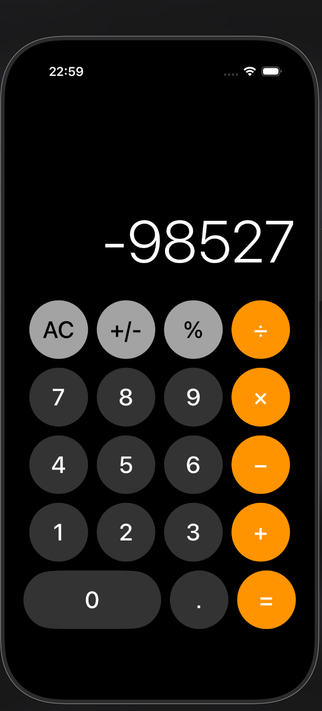

# 🧮 iOS Calculator App

My first iOS application built with SwiftUI and MVVM architecture.

## 📱 About This Project

As an Android developer transitioning to iOS, this is my first step into the Apple ecosystem. Coming from Kotlin and Android development, I'm excited to explore SwiftUI and learn iOS development patterns.

This calculator app represents my journey from Android to iOS development, implementing clean architecture principles I'm familiar with from Android in the Swift/iOS world.

## 🏗️ Architecture

Built using **MVVM (Model-View-ViewModel)** pattern:
- **Model**: `CalculatorButton`, `CalculatorOperation`
- **ViewModel**: `CalculatorViewModel` (Business logic)
- **View**: `ContentView`, `DisplayView`, `CalculatorButtonView` (UI)

## 🛠️ Tech Stack

- **Language**: Swift
- **Framework**: SwiftUI
- **Architecture**: MVVM
- **Design**: iOS Native Calculator inspired

## 📸 Screenshots

## 📚 Learning Journey

This project helped me understand:
- SwiftUI declarative syntax (similar to Jetpack Compose)
- MVVM pattern in iOS
- State management with `@Published` and `@StateObject`
- iOS design patterns and guidelines

## 🤝 Background

- 🤖 **Android Developer** with Kotlin experience
- 🍎 **iOS Beginner** - Just started learning
- 🎯 Expanding my skillset to become a versatile mobile developer
